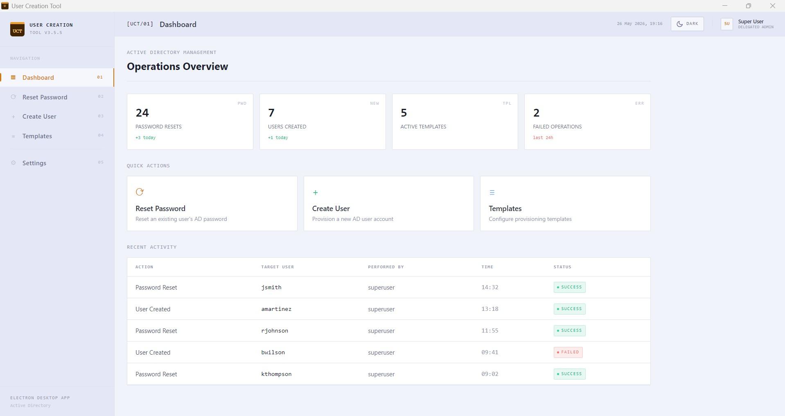

A lightweight, secure, and automated tool for creating Active Directory user accounts using predefined templates. Designed for IT admins who need fast, repeatable, and error‑free provisioning.

---

## 📥 Download
👉 **[Download Latest Release](https://github.com/smanifold123/User-Creation-Tool/releases/latest)**

---

## 🖼️ Screenshot Gallery

### Dashboard

### Reset Password

### Reset Password – Results

### Create User

### Create User – Clone

### Disable User – Search

### Disable User – Expire

### User Templates

### Settings – Part 1

### Settings – Part 2

### Domain Check

### RSAT Check

### Encryption Check

### Policy Check

---

## 📚 How It Works
1. Select a **user template**  
2. Enter required fields  
3. Tool automatically:  
   - Generates password  
   - Assigns groups  
   - Places user in correct OU  
   - Logs all actions  
4. User is created instantly in AD  

---

## 🛠️ Tech Stack
- PowerShell  
- WinForms / WPF  
- Active Directory module  

---

## 📦 Repository Structure
